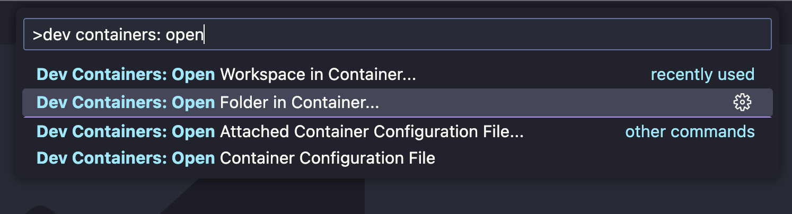
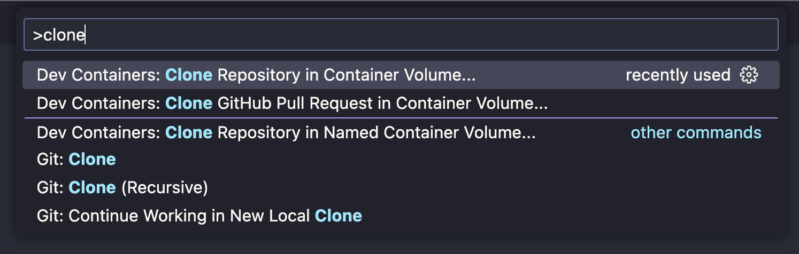

# Ruby on rails dev containers boilerplate

This repository contains a functional boilerplate to start new rails applications using the [VS Code dev containers feature](https://code.visualstudio.com/docs/devcontainers/containers).

The docker file in it and the docker-compose overall implementation are based on the [Ruby on whales repository](https://github.com/evilmartians/ruby-on-whales) from Evil Martians. More information about it on [this](https://evilmartians.com/chronicles/ruby-on-whales-docker-for-ruby-rails-development) article.

## How to use it?

This boilerplate is intended to work with Rails apps that use Postgres, Redis and Webpacker. To run different setups you will need to update the `Dockerfile` and the `docker-compose.yml` accordingly.

### Copying the .devcontainers folder into an existing project

As simple as it gets. Clone the repository with:

```bash
git clone git@github.com:victorfgs/rails_dev_containers_boilerplate.git
```
Then, copy the contents of the `.devcontainers` folder into the desired project:

```bash
cp -r ./rails_dev_containers_boilerplate ./path_to_target_project
```

After installing all the necessary extensions, press `cmd + shift + p` (or `ctrl + shift + p` on Windows or Linux) and search for `Dev Containers: Open folder in container`



VS Code will build the environment and spin up the containers and then you are set!

### Using as the base for a new project

This repository can be used as a starting point for a new Rails app. To do so open a new VS Code instance and press `cmd + shift + p` (or `ctrl + shift + p` on Windows or Linux) and search for `Dev Containers: Clone repository into container volume`



VS Code will build the environment and spin up the containers. With this blank sheet, you can open a terminal by pressing ``cmd + ` `` (or ``ctrl + ` `` on Windows or Linux) and then run the command to create a new rails app:

```bash
rails new . -d=postgresql
```

Now you are good to go! Just remember to add a new git remote origin to push your new code.

## A brief disclaimer

This is a very (VERY) barebones version of a boilerplate. This means that changes to adapt the content of this repo to your repo are expected. Please, check ruby, node, postgres, redis and other versions on the imported files and make the updates as you see fit to make everything work.

## License

The code is available as open source under the terms of the [MIT License](http://opensource.org/licenses/MIT).